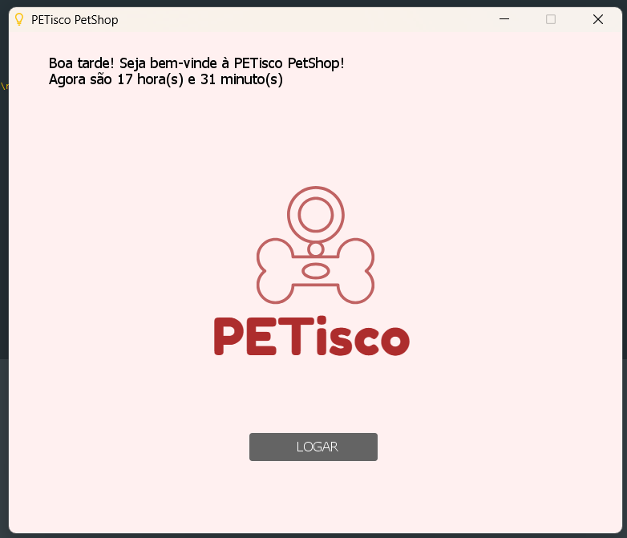
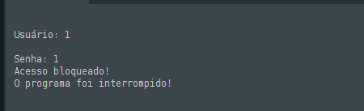
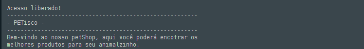
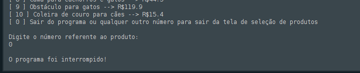
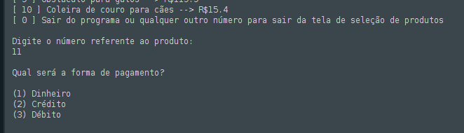
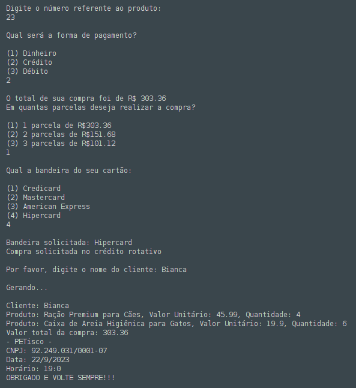

# PETisco - versão quebrada
    Este projeto simula uma caixa registradora que deve ser exibida e
    executada no console Portugol.
    Separado por algumas funções e variáveis, o programa consiste em 
    algumas etapas, que juntas tornam o projeto completo funcional.

## Imagens

#### Interface gráfica

#### Sistema de login
> Acesso bloqueado:
>
> 

> Acesso liberado:
>
> 

#### Sitema do caixa

Em caso de acionar 0:

Em caso de acionar 11:

#### Forma de pagamento

